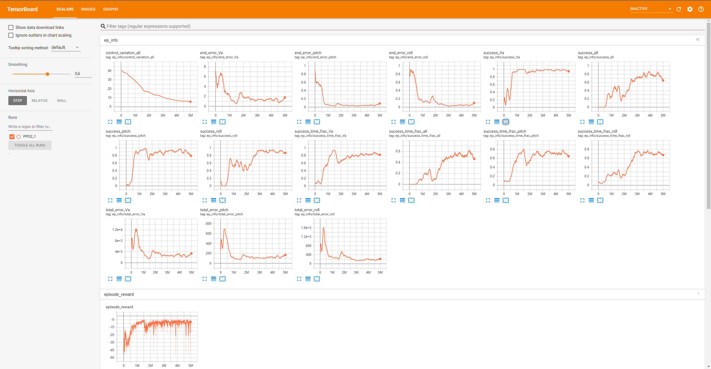

### Installation

To use these scripts, install the stable-baselines library as described in the documentation or if you want to use the CNN-MLP policy described in the paper you need to install my [fork](https://github.com/eivindeb/stable-baselines).

```shell
git clone https://github.com/eivindeb/stable-baselines
cd stable-baselines
pip install -e .
```shell

```

### Evaluating controllers
The test_sets folder contains the four test sets used in the paper. Controllers can be evaluated on these sets by running e.g.:
```shell
python evaluate_controller.py test_sets/test_set_wind_none_step20-20-3.npy 4 --PID --env-config-path fixed_wing_config.json --turbulence-intensity "none"
```

Which will evaluate the PID controller on the test set with no wind or turbulence. The model folder contains
the RL controller used in the paper, as well as an MLP RL controller usable with the default version of stable-baselines.

The included RL controllers and the PID controller were evaluated on these sets with PyFly v0.1.1 (commit #932888c), 
producing the results shown in the table below. To reproduce the results shown here, make sure to use this PyFly version 
by either installing the PyFly dependency from source or ensuring the correct version in gym-fixed-wing's setup.py prior to installation of the fixed-wing gym.

|                     	|            	|       	| Success 	|     	|     	|       	| Rise time 	|       	|       	| Settling time 	|       	|       	| Overshoot 	|     	| Control variation 	|
|---------------------	|:----------:	|:-----:	|:-------:	|:---:	|:---:	|:-----:	|:---------:	|:-----:	|:-----:	|:-------------:	|:-----:	|:-----:	|:---------:	|:---:	|:-----------------:	|
| Setting             	| Controller 	| &phi; 	| &theta; 	|  Va 	| All 	| &phi; 	|  &theta;  	|   Va  	| &phi; 	|    &theta;    	|   Va  	| &phi; 	|  &theta;  	|  Va 	|                   	|
| No turbulence       	| RL (CNN)   	|   100 	|     100 	| 100 	| 100 	| 0.253 	|     0.614 	| 0.803 	| 1.594 	|         1.580 	| 2.704 	|    25 	|        34 	|  31 	|             0.638 	|
|                     	| RL (MLP)   	|   100 	|     100 	| 100 	| 100 	| 1.395 	|     0.336 	| 0.959 	| 2.085 	|         1.675 	| 2.308 	|     5 	|        25 	|  20 	|             0.410 	|
|                     	| PID        	|   100 	|     100 	| 100 	| 100 	| 1.337 	|     0.226 	| 1.016 	| 2.018 	|         1.294 	| 2.203 	|     3 	|         9 	|  29 	|             0.291 	|
| Light turbulence    	| RL (CNN)   	|   100 	|     100 	| 100 	| 100 	| 0.202 	|     0.751 	| 0.751 	| 1.690 	|         1.710 	| 2.646 	|    32 	|        50 	|  58 	|             0.888 	|
|                     	| RL (MLP)   	|   100 	|     100 	| 100 	| 100 	| 1.243 	|     0.406 	| 0.869 	| 2.099 	|         1.932 	| 2.530 	|     6 	|        30 	|  42 	|             0.920 	|
|                     	| PID        	|   100 	|     100 	| 100 	| 100 	| 1.150 	|     0.286 	| 0.934 	| 1.996 	|         1.368 	| 2.324 	|     6 	|        11 	|  41 	|             0.539 	|
| Moderate turbulence 	| RL (CNN)   	|   100 	|     100 	|  99 	|  94 	| 0.186 	|     0.836 	| 0.844 	| 2.049 	|         2.175 	| 3.766 	|    52 	|        82 	| 106 	|             1.065 	|
|                     	| RL (MLP)   	|    98 	|      98 	|  97 	|  97 	| 0.877 	|     0.778 	| 0.735 	| 2.814 	|         3.169 	| 3.819 	|    51 	|        52 	| 102 	|             1.399 	|
|                     	| PID        	|   100 	|      98 	|  97 	|  92 	| 0.891 	|     0.374 	| 0.719 	| 2.250 	|         1.628 	| 3.155 	|    17 	|        24 	|  80 	|             0.878 	|
| Severe turbulence   	| RL (CNN)   	|    98 	|      98 	|  94 	|  85 	| 0.158 	|     0.944 	| 1.298 	| 2.626 	|         2.652 	| 6.424 	|   106 	|       102 	| 197 	|             1.208 	|
|                     	| RL (MLP)   	|    94 	|      94 	|  89 	|  89 	| 0.690 	|     1.113 	| 1.242 	| 3.668 	|         4.512 	| 5.412 	|   140 	|        91 	| 167 	|             1.937 	|
|                     	| PID        	|    96 	|      94 	|  93 	|  85 	| 0.653 	|     0.605 	| 1.314 	| 2.617 	|         2.779 	| 5.157 	|    53 	|        50 	| 121 	|             1.112 	|

The outputs of the evaluation scripts can be found in the evaluations folder.
Due to refactoring of the code base and various changes in the gym environment, these are not the exact values reported in the paper,
however, they support the same trends highlighted in the paper.

Note that the RL MLP controller does not represent any best efforts to produce an optimal controller, but rather the controller
obtained by running example training script below once.

### Training controllers

To train a reinforcement learning controller, run the train_rl_controller.py script, e.g. to run with 4 processes for 5 million time steps and evaluate on the no turbulence test set, do:
```shell
python train_rl_controller.py "ppo_example" 4 --train-steps 5e5 --test-set-path test_sets/test_set_wind_none_step20-20-3.npy
```

This script trains a PPO agent to do attitude control of a fixed-wing aircraft. It saves checkpoints of models, renders episodes
 during training so that its behavior can be inspected, runs periodic test set evaluations if a test set path is supplied, and logs
 all training information to tensorboard such that its progress can be monitored.
 
 ```shell
tensorboard --logdir models/ppo_example/tb
```


